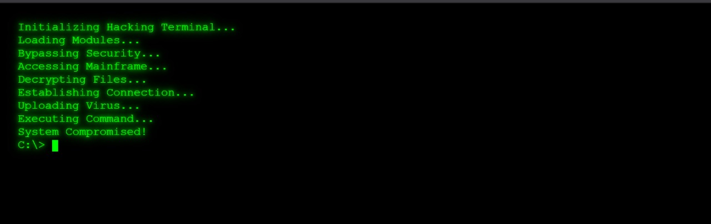

# Hacking Terminal Simulator 💻

Ever wanted to feel like a 2000s movie hacker without actually going to jail? Boom. Here's your personal hacking terminal — green text, blinking cursor, shady commands — all drama, zero consequences.

## What is this?
This is a simple (but super cool) HTML + CSS + JavaScript project that:
* Types out "hacking" steps automatically
* Adds random typing delays to make it realistic
* Ends with a *blinking cursor* like you're ready to enter more "top secret" commands
* Makes you look 1000% cooler instantly. Trust me.

## Features ✨
* Typing animation that feels alive
* Random speed between keystrokes (because no one types perfectly)
* Cool neon green "Matrix-style" glow
* Realistic blinking cursor at the end
* Super lightweight — just open in your browser and flex

## How to Use
1. Download or clone this repository
2. Open `index.html` in any modern browser
3. Watch as your screen fills with "hacker" commands
4. Feel like you're in a Hollywood movie about cybersecurity

## Code Breakdown
The simulator uses:
- **HTML**: Basic structure
- **CSS**: Terminal styling with glow effects
- **JavaScript**: Async functions for realistic typing animation

## Screenshot 📸


## Customization
Want to change things up? Here are some easy mods:
- Edit the `text` array in the JavaScript to change what commands appear
- Adjust the timing variables to make typing faster/slower
- Change the color in CSS from `#00ff00` to another color (but why would you?)

## Folder Structure
```
/hackersterminal
├── index.html
├── README.md
└── assets
    └── preview.jpg
```

## License
Free to use for your next Zoom background, pretending to be a hacker at coffee shops, or whatever else makes you happy.

## Contributing
Found a way to make this even cooler? Pull requests welcome! Let's make this the most over-dramatic hacking simulator on the internet.

---

*Note: No actual systems were hacked in the making of this project. Though your friends watching over your shoulder might think otherwise.*
